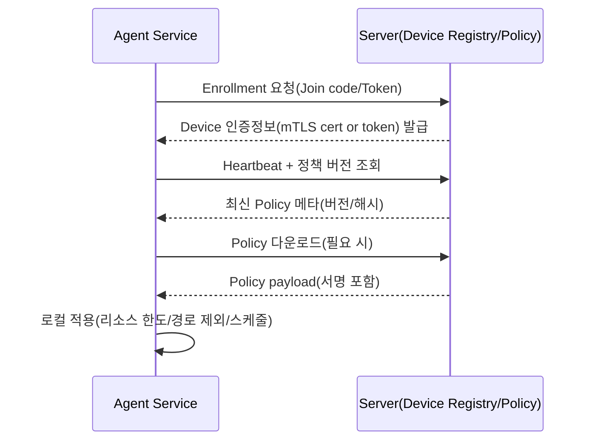
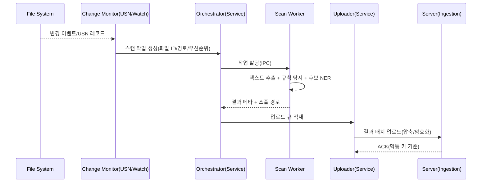
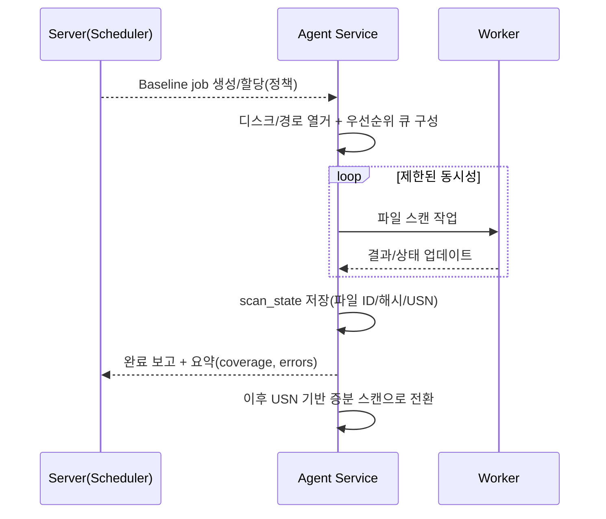
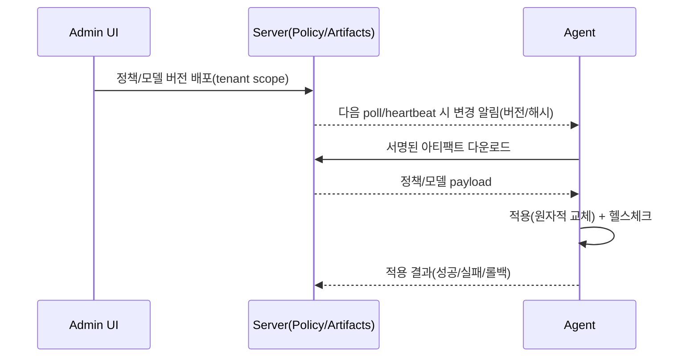

# PII Scanner 시스템 아키텍처 (System Architecture) v0.1

작성자: Teammate 3 (Systems Architect)  
대상: Windows PC 개인정보(PII, Personally Identifiable Information) 탐지 에이전트 + 서버(관리/수집)  
범위: “실제 구현 가능한” 수준의 모듈/데이터 플로우/운영 설계 초안

## 1. 요구사항 (Requirements)

### 1.1 기능 요구사항 (Functional)
- Windows PC의 파일 내 개인정보(PII) 탐지 및 관리자 서버로 결과 보고
- 실시간 파일 감지(Real-time file change detection) + 증분 스캔(Incremental scan)
- 하이브리드 탐지: 규칙 기반(Rule-based: regex, checksum 등) + NER(Named Entity Recognition) 기반 비정형 PII 탐지
- 대규모 운영: 수만 대(예: 50,000대) 디바이스 관리, 정책 배포, 작업 스케줄링, 결과 수집
- 오탐/과탐(False positive) 최소화 및 미탐(False negative) 저감

### 1.2 비기능 요구사항 (Non-functional)
- 사용자 업무 방해 최소화: CPU/IO/메모리 제한, UI 팝업 최소화, 백그라운드 동작
- CPU-only: GPU 없는 기업 PC 환경에서 동작
- 안정성/복구성: 장애 격리(Fault isolation), 자동 재시작, 오프라인 버퍼링
- 보안: 상용 제품 수준의 통신/저장 암호화, 인증/권한, 코드 서명(Code signing), 감사(Audit)
- 배포 유연성: 온프렘(On-prem) 및 클라우드(Cloud) 모두 지원 가능한 서버 배포

### 1.3 운영 가정 (Assumptions)
- 클라이언트 OS: Windows 10/11 Enterprise 계열
- 파일 시스템: 주로 NTFS(USN Journal 활용 가능성이 높음)
- 네트워크: 에이전트는 서버로 아웃바운드(Outbound) 연결 가능, 인바운드(Inbound) 포트 오픈은 불가한 환경이 다수

### 1.4 MVP 범위(MVP Scope) 및 운영 SLO(SLO)
본 문서는 전체 방향을 다루지만, 초기 MVP(예: 3-4개월)에서 “실제 구현 가능한” 범위를 아래처럼 명시한다.

- 지원 범위(Support Matrix) 선언:
  - 로컬 NTFS: 완전 지원(full support). USN Journal 기반 증분 스캔 가능.
  - 비-NTFS/네트워크 공유(UNC)/클라우드 동기화 폴더: 제한 지원(limited). USN 불가 시 주기 스캔(periodic scan) + 핵심 경로 watcher로 degrade.
  - 근거: 기업 환경의 다양성은 크지만, 모든 케이스를 MVP에서 동시에 해결하면 품질/일정 리스크가 폭발한다.
- 파일 포맷(MVP):
  - 기본 지원: `txt/csv/log` + `OOXML(docx/xlsx/pptx)` 내장 추출기(built-in extractor)
  - 후순위(Phase 2+ 옵션): IFilter, PDF 고품질 추출, 아카이브(archive) 심화, OCR
  - 근거: 텍스트 추출은 안정성과 성능을 동시에 흔드는 가장 큰 리스크 영역이므로, MVP에서는 포맷 범위를 강하게 제한하는 편이 성공 확률이 높다.
- 실시간(Real-time) SLO:
  - 핵심 경로(정책 지정)는 30초 이내 스캔 작업 큐잉(queueing), 5분 이내 1차 규칙 탐지 완료를 목표로 한다.
  - 그 외 경로는 USN 폴링 5-15분 내 eventual 처리로 정의한다.
  - 근거: 전 볼륨 즉시성은 워처(Watcher) 확장 비용과 누락 리스크가 커 CPU-only/업무방해 목표와 충돌한다.
- 업데이트(Update):
  - MVP에서는 에이전트 바이너리 업데이트를 고객사의 기존 배포 체계(MDM/SCCM/MSI)로 처리하는 것을 기본으로 하고, 제품 내 Updater는 Phase 2+로 둔다.
  - 다만 정책/룰/모델 번들(artifact)은 서명 검증(signed bundle verification)으로 안전하게 업데이트 가능해야 한다.

## 2. 상위 아키텍처 (High-level Architecture)

### 2.1 구성요소 (Components)
- Client(Windows)
  - `Agent Service`: Windows Service로 상시 동작, 감지/스캔/업로드 오케스트레이션(Orchestration)
  - `Worker(s)`: 파일 파싱/스캔 등 무거운 작업을 별도 프로세스로 수행
  - `Local State`: 증분 스캔용 로컬 인덱스/큐(Queue) 저장
- Server
  - `Device Registry`: 디바이스 등록/인증/상태(heartbeat)
  - `Policy/Config`: 정책(탐지 규칙, 경로 제외, 리소스 한도) 배포
  - `Scheduler/Jobs`: 풀스캔/증분 스캔/업데이트 작업 스케줄링
  - `Ingestion`: 결과 수집/검증/비동기 처리
  - `Reporting/UI`: 관리자 콘솔, 검색/리포트/감사 로그
  - `Storage`: DB + Object Storage
  - `Observability`: 로그/메트릭/트레이싱/알림

### 2.2 핵심 설계 원칙 (Key Principles)
- 에이전트는 “지속 연결”이 아니라 “탄력적 연결(Resilient connectivity)”을 기본으로 한다.
  - 근거: 기업 환경에서 프록시(Proxy), TLS 가로채기(SSL inspection), 네트워크 단절이 빈번하며 50k 동시 연결은 운영 부담이 커질 수 있음.
- 결과 전송은 “고빈도 이벤트 전체”가 아니라 “압축/배치(Batching)된 의미 있는 결과” 중심으로 한다.
  - 근거: 파일 변경 이벤트는 매우 많고, 서버/네트워크 비용을 폭증시킬 수 있음. 탐지 결과와 텔레메트리(telemetry)만 보내는 구조가 비용/확장성에 유리.
- 상태는 “Desired State(원하는 상태)”를 서버가 들고, 에이전트는 이를 수렴(Converge)한다.
  - 근거: 정책/버전/스케줄을 멱등(Idempotent)하게 적용할 수 있고, 오프라인/재설치에 강함.

## 3. 클라이언트 Agent 아키텍처 (Windows)

### 3.1 프로세스/서비스 모델 (Process/Service Model)

**결정(Decision):** 에이전트는 기본적으로 `Windows Service` 1개 + 스캔 워커(Worker) 프로세스 N개로 구성한다. 필요 시 별도 `Tray UI`를 선택적으로 제공한다.

**구성**
- `pii-agent-svc` (Windows Service)
  - 역할: 파일 변경 감지, 정책 적용, 작업 큐 관리, 워커 수명주기 관리, 서버 통신, 업데이트
- `pii-scan-worker` (User-mode worker process, 다중 실행 가능)
  - 역할: 파일 열기/텍스트 추출/탐지 파이프라인 실행(규칙+NER), 결과 생성
- `pii-agent-ui` (Optional tray app)
  - 역할: 사용자 알림 최소화(필요 시), 상태 보기, 로컬 예외(허용 시)

**근거**
- Windows Service는 재부팅/로그오프에도 안정적으로 동작하며 엔터프라이즈 배포(GPO/SCCM/MSI)와 맞음.
- 파일 파싱/NER 추론은 크래시 위험과 리소스 부담이 크므로 서비스 프로세스에서 분리해 장애 격리(Fault isolation) 및 메모리 누수 영향 최소화.
- UI는 업무 방해를 줄이기 위해 기본 비활성화가 바람직하며, “관리자 중심(Administrator-centric)” 제품 특성과 부합.

### 3.2 모듈 구조 (Agent Modules)

#### 3.2.1 `pii-agent-svc` 내부 모듈
- `Policy Manager`: 정책/모델 버전/스케줄 수신 및 로컬 적용
- `File Change Monitor`: 변경 이벤트 수집(USN Journal, ReadDirectoryChangesW 등)
- `Scan Orchestrator`: 작업 생성/중복 제거(Dedup)/우선순위 부여, 워커에 분배
- `Local Queue/State Store`: 로컬 작업 큐, 파일 스캔 상태(증분) 저장
- `Uploader`: 결과 배치/압축/암호화 후 서버 업로드, 재시도(Backoff)
- `Health/Watchdog`: 워커 헬스체크, 크래시 재시작, 자체 진단(Self-diagnostics)
- `Updater(옵션)`: 에이전트/모델 업데이트 다운로드 및 원자적 교체(Atomic replace)
  - MVP에서는 고객 배포 체계를 우선 사용하고, 정책/룰/모델 번들 업데이트만 제품 내에서 다룰 수 있다.

#### 3.2.2 `pii-scan-worker` 내부 모듈
- `File Access`: 파일 열기(권한/잠금 처리), 스트리밍 읽기(Streaming)
- `Text Extractor`: 포맷별 텍스트 추출(MVP: TXT/CSV/LOG, OOXML; Phase 2+: IFilter/PDF), 용량 제한/타임아웃
- `Detectors`
  - `Rule Detectors`: regex, checksum(Luhn 등), 패턴 사전(Dictionary), 키워드(Aho-Corasick)
  - `NER Engine`: ONNX Runtime 기반 CPU 추론(Quantization 모델), 후보 텍스트에만 적용
- `Scoring/Decision`: 규칙+NER 결과를 스코어링하여 “탐지/무시/재검” 결정
- `Result Builder`: 최소정보 원칙(Minimum necessary)으로 리포트 구성(경로/해시/PII 타입/근거)

**근거**
- 탐지 파이프라인을 `Extractor`와 `Detectors`로 분리하면 포맷 지원 확장과 모델 교체가 쉬움.
- 규칙 기반은 빠르고 명확한 근거를 제공하며, NER은 비용이 크므로 “의심 구간(Suspicious segments)”에만 적용하는 하이브리드가 CPU-only 요구사항에 부합.

### 3.3 IPC(Inter-Process Communication) 설계

**결정(Decision):** 서비스와 워커 간 IPC는 `Named Pipe` + `Protobuf` 기반의 요청/응답을 사용한다. (필요 시 gRPC-like framing을 사용하되, 네트워크 gRPC 의존을 강제하지 않음)

**IPC 채널**
- Control: 서비스 -> 워커 작업 지시, 워커 -> 서비스 진행/결과 보고
- Data: 워커 결과는 로컬 디스크 스풀(spool) 파일로 저장 후, 서비스가 업로드(큰 payload 분리)

**근거**
- Named Pipe는 Windows에서 권한(ACL) 제어가 명확하고 로컬 IPC로 성능이 좋음.
- 큰 결과를 IPC로 직접 전송하면 메모리 압박/헤드오브라인 블로킹(HoL)이 커지므로, “파일 스풀 + 메타 IPC”가 안정적.

### 3.4 장애 격리(Fault Isolation)와 복구(Recovery)

**결정(Decision):** 워커는 “격리된 프로세스 + 강제 제한(Job Object)”으로 실행하고, 서비스가 워커를 감시(Watchdog)한다.

**메커니즘**
- 워커를 Windows `Job Object`에 넣어 CPU/메모리 제한을 강제
- 작업 단위 타임아웃(timeout)과 단계별 취소(cancellation) 지원
- 워커 크래시 시 작업을 `Retry(재시도)` 또는 `Quarantine(격리)` 큐로 이동
- 반복 크래시 파일은 “파일 핑거프린트 기반 블랙리스트(temporary)”로 단기간 재시도 억제

**근거**
- 포맷 파서/외부 라이브러리는 입력에 민감하며, 악성/손상 파일로 크래시가 날 수 있음. 프로세스 격리가 서비스 안정성을 보장.
- 대규모 환경에서 “한 대의 PC 문제”가 전체 배포 신뢰를 무너뜨리므로, 자동 복구와 안정적 실패(fail-safe)가 중요.

### 3.5 로컬 저장소(Local State)와 오프라인 동작

**결정(Decision):** 로컬 상태는 `SQLite`(또는 동급 임베디드 DB) + 스풀 디렉터리로 구성한다.

**저장 내용**
- `scan_state` 테이블: 파일 ID/경로/해시/USN/마지막 스캔 시점/결과 요약
- `task_queue` 테이블: 대기 작업, 우선순위, 재시도 횟수
- `upload_spool/`: 업로드 대기 결과(압축된 JSON/Protobuf blob)

**보안**
- 스풀/DB는 디바이스 키로 암호화(Encryption-at-rest) 옵션 제공
- 보존 기간(retention) 정책으로 자동 삭제

**근거**
- 오프라인/프록시 문제로 업로드 실패가 잦을 수 있으므로, 로컬 큐가 없으면 탐지 결과 유실 위험이 큼.
- SQLite는 트랜잭션/인덱싱이 있어 증분 스캔의 중복 제거와 재시도 처리에 유리.

### 3.6 탐지 파이프라인 (Hybrid Detection Pipeline)

#### 3.6.1 단계(Stages)
- Stage A: 파일 메타 필터링(Metadata filtering)
  - 크기/확장자/경로 제외(Exclusion), 최근 변경만, 아카이브(archive) 정책
  - 근거: 불필요한 파일을 초기에 제외해 IO 부담과 오탐을 줄임.
- Stage B: 빠른 규칙 탐지(Fast rule detection)
  - 주민/사업자/카드번호 등 checksum 기반, 이메일/전화/계좌 등 regex 기반
  - 근거: 비용 대비 정확도가 높고 근거 제시가 쉬움(“왜 탐지했는가”).
- Stage C: 후보 텍스트 추출(Candidate extraction)
  - 전체 텍스트가 아니라 “규칙 근접 구간” 또는 “키워드 주변 컨텍스트”를 잘라냄
  - 근거: NER 입력 토큰 수를 줄여 CPU 비용을 선형으로 감소.
- Stage D: NER 적용(NER inference)
  - 인명/주소/기관 등 비정형 엔티티를 추정
  - 근거: 한국어 비정형 PII는 regex만으로 한계가 크므로 보완 필요.
- Stage E: 스코어링/정책 판정(Scoring & policy decision)
  - 규칙+NER 결과를 합산해 `확정 탐지/의심/무시`로 분류
  - 근거: NER은 확률적이므로 정책 기반의 임계값(threshold)과 조합 규칙이 필요.

#### 3.6.2 결과(Findings) 모델(예시)
- `finding_type`: 주민번호/여권/전화/이메일/주소/이름+주소 조합 등
- `evidence`: 규칙 매치 종류, checksum 통과 여부, NER 엔티티와 confidence(신뢰도)
- `file_locator`: 경로(옵션), 파일 ID, 해시, 크기, 수정시간
- `severity`: 정책 기반 위험도

**근거**
- 결과는 “재현 가능한 근거(Explainability)”를 포함해야 관리자가 오탐을 판단하고 정책을 개선할 수 있음.

## 4. 실시간 파일 감지 (Real-time File Change Detection)

### 4.1 선택지 비교

| 선택지 | 장점(Pros) | 단점(Cons) | 적합도 |
|---|---|---|---|
| ReadDirectoryChangesW | 구현 난이도 낮음, 지연(latency) 낮음, 특정 디렉터리 실시간 감지 | 감시 대상 디렉터리 수 증가 시 핸들/리소스 부담, 재부팅/버퍼 오버플로우 시 누락 가능, 볼륨 전체 감시가 어려움 | “핵심 폴더” 실시간 감지에 유리 |
| USN Journal(변경 저널) | NTFS 볼륨 단위로 변경 이력 추적, 누락 보정에 강함, rename/move 추적 가능(파일 참조 ID) | NTFS/권한/정책 의존, 초기 구현 복잡, 즉시성은 폴링 주기에 좌우 | 증분 스캔의 기반(Backbone)으로 유리 |
| Minifilter(미니필터 드라이버) | 커널 레벨에서 파일 I/O 이벤트 정확히 관찰, 매우 높은 커버리지, 안티탬퍼/DRM 분류 등에 유리 | 개발/테스트/서명(Driver signing) 비용 큼, 호환성 리스크, 장애 시 시스템 영향이 큼 | 장기 로드맵(Enterprise-grade) |

### 4.2 MVP 설계(권장)

**결정(Decision):** MVP는 `USN Journal 기반 증분 스캔`을 기본으로 하고, “즉시성이 중요한 제한된 경로”에 한해 `ReadDirectoryChangesW`를 병행한다.

**구성**
- `USN Poller`: 볼륨별로 USN을 주기적으로 읽어 변경된 파일 목록을 큐에 적재
- `Targeted Watchers`: 사용자 문서/다운로드/데스크톱/공유폴더 등 정책으로 지정된 경로만 ReadDirectoryChangesW로 감지
- `Reconciliation`: 워처 누락을 USN으로 보정, USN 누락(저널 리셋 등)을 주기적 샘플/해시로 보정

**근거**
- 50k 환경에서 “모든 디렉터리를 워처로 감시”는 엔드포인트 리소스와 구현 복잡도가 커짐.
- USN은 “증분”과 “누락 보정”에 강하고, 워처는 “지연 최소화”에 강하므로 상호 보완적.
- Minifilter는 상용 수준의 커버리지/안티탬퍼에 강하지만, MVP 시점에 커널 드라이버를 도입하면 일정/품질 리스크가 과도함.

### 4.3 확장 로드맵(향후)
- Phase 2: 포맷 커버리지 확장
  - Windows IFilter(IFilter) 또는 서드파티 파서로 문서 포맷 지원 확대(예: 레거시 오피스, 특정 CAD 등)
  - 근거: 자체 파서만으로 모든 포맷을 커버하기 어렵고, 기업 환경에서 다양한 포맷이 존재.
- Phase 3: Minifilter 옵션 제품화(Optional)
  - “고보안/고규모 고객”에 한해 minifilter 기반 실시간 감지/안티탬퍼 모듈 제공
  - 근거: 커널 드라이버는 운영 리스크가 높아 기본 제품 경로와 분리하는 편이 현실적.

## 5. 리소스 관리(Resource Management)

### 5.1 목표
- 사용자 체감 성능 저하를 “지속적으로” 막는다.
- 리소스 제한은 정책으로 중앙 제어(Central control) 가능해야 한다.
- 급증(Spike)을 피하고, 스캔은 “점진적(Gradual)·탄력적(Elastic)”으로 수행한다.

### 5.2 CPU 제한

**결정(Decision):** 워커는 Job Object로 CPU rate를 제한하고, 스레드 우선순위(Thread priority)와 EcoQoS(Eco Quality of Service)를 활용한다.

**구현 포인트(예시)**
- Job Object: `JOB_OBJECT_CPU_RATE_CONTROL_INFORMATION` 기반으로 워커별 CPU 상한 설정
- 프로세스 우선순위: `BELOW_NORMAL_PRIORITY_CLASS` 또는 `IDLE_PRIORITY_CLASS`로 기본 설정
- 동적 동시성: 시스템 CPU 사용률이 임계치 초과 시 워커 수를 줄이고 큐를 지연

**근거**
- 단순 “스레드 sleep”은 예측 가능성이 낮고, CPU 경쟁이 심한 상황에서 스로틀(throttle)이 깨질 수 있음.
- OS 레벨 제한은 일관된 사용자 경험을 제공하며 운영 정책화가 용이.

### 5.3 IO(디스크) 제한

**결정(Decision):** IO는 “동시 읽기 수 제한 + 읽기 바이트율 제한 + 큰 파일 샘플링”의 3중 방어를 둔다.

**구현 포인트**
- 워커 동시 처리 파일 수 제한(예: 1~2개) 및 전역 semaphore
- 스트리밍 읽기: 작은 버퍼로 순차 읽기(sequential), 최대 읽기량 cap(예: 파일당 최대 N MB)
- 큰 파일 정책
  - 텍스트 기반 파일은 부분 샘플링 + 해시 기반 재검 정책
  - 아카이브(zip 등)는 “깊이/파일 수/총 용량” 제한

**근거**
- 디스크 IO는 사용자 체감 저하를 직접 유발하므로, CPU보다 보수적으로 제어해야 함.
- 파일 전체 읽기를 기본으로 하면 대용량 파일/아카이브에서 스캔이 비정상적으로 길어질 수 있음.

### 5.4 메모리 제한

**결정(Decision):** 파서/NER는 상한을 강제하고, 상한 초과 시 “부분 추출 + degraded mode(저하 모드)”로 동작한다.

**구현 포인트**
- 워커 프로세스 메모리 상한: Job Object 메모리 제한
- 텍스트 추출 결과 길이 제한(예: 최대 문자 수/토큰 수)
- NER 입력 윈도잉(windowing): 후보 구간만 분할 처리

**근거**
- 문서 파싱은 비정상 입력에서 메모리 폭주가 발생할 수 있으며, 단일 PC에서 안정성이 최우선.

### 5.5 UX(사용자 경험) 방해 최소화

**결정(Decision):** 기본 정책은 “무알림(silent)”이며, 사용자 활동 신호(user activity signals)에 따라 스캔 강도를 자동 조절한다.

**구현 포인트**
- Idle 감지: 최근 입력 시간(예: `GetLastInputInfo`) 기반으로 “유휴(Idle) 모드”에서만 공격적으로 스캔
- 노트북 배터리/전원 상태 기반 스로틀(AC 연결 시 강화, 배터리 시 완화)
- 업무시간/유지보수창(Maintenance window) 정책 지원
- 사용자 알림은 “치명적 장애/정책 위반” 등 제한된 상황에만

**근거**
- 사용자 방해는 제품 실패의 주요 원인이며, 팝업/고부하는 곧 “비활성화/삭제”로 이어짐.

## 6. 서버 아키텍처 (50,000대 규모)

### 6.1 서버 목표와 원칙
- 수만 대 디바이스의 상태/정책/작업을 안정적으로 처리
- 결과 수집은 비동기(Async)로 분리하고, 멱등(idempotent)한 ingestion을 보장
- 멀티테넌시(Multi-tenancy) 지원: tenant 간 데이터/권한 격리
- 관측성(Observability)과 감사(Audit) 내장

### 6.2 서버 구성요소 (Logical Services)

**권장 구현 형태:** 초기에는 “모듈형 모놀리스(Modular monolith) + 비동기 워커”로 시작하고, 병목이 확인되는 영역부터 분리한다.

**근거**
- MVP에서 과도한 마이크로서비스(Microservices)는 운영 복잡도를 급증시킴.
- 50k 스케일은 “잘 만든 모놀리스 + 큐 + 수평 확장”으로도 충분히 시작 가능.

**모듈**
- `Auth/RBAC`: SSO(SAML/OIDC) 연동, 역할 기반 접근 제어(Role-based access control)
- `Tenant Service`: 테넌트/조직/정책 범위 관리
- `Device Registry`: 등록(enrollment), 인증(mTLS), heartbeat, 인벤토리
- `Policy Service`: 정책 버전 관리, 배포 상태 추적, 롤백
- `Job Scheduler`: 풀스캔/증분/업데이트 작업 생성 및 rate limiting
- `Ingestion Service`: 결과 업로드, 검증, 큐 적재
- `Processing Workers`: 큐 소비(consume), 중복 제거, 집계, 알림 트리거
- `Reporting/API`: 검색, 리포트, 내보내기(export), 감사 로그 조회
- `License Service`: 구독/디바이스 수 제한, 오프라인 유예(grace) 정책

### 6.3 API/통신 선택 (gRPC vs HTTP)

**결정(Decision):** “관리자/콘솔”은 HTTP/JSON(REST), “에이전트 데이터 플레인”은 gRPC(HTTP/2) 또는 HTTPS 업로드를 병행 지원한다.

**근거**
- Admin UI/외부 연동(SIEM, ITSM)은 REST가 호환성이 가장 좋음.
- Agent는 효율적인 바이너리 프로토콜(Protobuf)과 배치 업로드가 유리하나, 일부 기업 프록시가 gRPC를 제한할 수 있음.
- 따라서 “gRPC 우선 + HTTPS 폴백(fallback)” 구조가 실제 현장 적용에 안전.

### 6.4 데이터 저장소(Storages)와 메시징(Message Queue)

**결정(Decision):** 메타데이터는 `PostgreSQL`, 대용량 아티팩트는 `S3 호환 Object Storage`, 비동기 처리는 `메시지 큐(Message Queue)`를 사용한다.

**권장 스택(예시)**
- DB: PostgreSQL
  - 근거: 트랜잭션/정합성/쿼리 성능, 멀티테넌시 구현(tenant_id), 성숙한 운영.
- Object Storage: S3 또는 MinIO(S3-compatible)
  - 근거: 결과 원문/샘플/압축 blob은 DB에 넣기 부적합, 온프렘에서 MinIO로 대체 가능.
- Message Queue: NATS JetStream 또는 Kafka
  - NATS JetStream 근거: 운영이 비교적 단순, 적당한 처리량, 작업/이벤트 큐에 적합.
  - Kafka 근거: 초대형 처리량/내구성/리플레이(replay)에 강함, 도입/운영 비용이 큼.
  - 선택 가이드: MVP는 NATS JetStream, “이벤트량이 매우 큰 고객/클러스터”는 Kafka 옵션을 고려.
- Cache: Redis(선택)
  - 근거: 정책/토큰/레이트리밋(rate limit) 등의 핫데이터 캐싱.
- Search/Analytics(선택): OpenSearch 또는 ClickHouse
  - 근거: 대량 결과의 빠른 검색/집계를 DB만으로 감당하기 어려워질 때 단계적으로 도입.

### 6.5 멀티테넌시(Multi-tenancy) 설계

**결정(Decision):** 기본은 “단일 DB + tenant_id 기반 논리 분리(Logical isolation)”로 시작하고, 대형 고객은 “DB 분리 옵션(Physical isolation)”을 제공한다.

**근거**
- 단일 DB는 운영 단순성과 기능 개발 속도가 빠르며, 50k 수준에서 충분히 확장 가능.
- 금융/공공 등 일부 고객은 물리적 분리를 요구할 수 있어 옵션 경로가 필요.

### 6.6 디바이스 등록/상태(Device Enrollment & Status)

**등록 흐름**
- 관리자가 설치 패키지에 `Enrollment Token`(단기) 또는 `Tenant Join Code`를 포함
- 에이전트가 최초 부팅 시 서버에 등록 요청
- 서버가 디바이스에 `Device Certificate`(mTLS) 발급 또는 기기 고유 키 기반 토큰 발급

**근거**
- mTLS는 대규모 단말 인증에 강하고, 토큰 유출 위험을 줄임.
- 디바이스 인증이 견고해야 “가짜 단말/대량 스팸 업로드”를 방지할 수 있음.

**상태(Heartbeat)**
- 주기적 heartbeat: 에이전트 버전, 정책 버전, 큐 적체, 리소스 상태, 마지막 스캔 시각
- 서버는 “desired state와 actual state” 차이를 기반으로 재배포/재시도 결정

### 6.7 정책 배포(Policy Distribution)

**결정(Decision):** 정책은 `버전 관리(versioned)`되며, 에이전트는 주기적으로 “최신 정책 해시”를 확인하고 필요 시만 다운로드한다.

**근거**
- 50k 단말에서 정책을 매번 내려받으면 서버/네트워크 비용이 커짐.
- 버전/해시 기반은 멱등 적용과 롤백이 쉬움.

### 6.8 작업 스케줄링(Job Scheduling)

**결정(Decision):** 서버는 “작업 생성(what/when)”을 중앙에서 정의하되, 실행 시점은 에이전트가 정책 범위 내에서 `jitter(무작위 지연)`를 적용해 분산 실행한다.

**근거**
- 중앙에서 동일 시각 실행을 지시하면 “thundering herd(동시 폭주)”로 서버/네트워크가 불안정해짐.
- 에이전트가 자율적으로 분산하면 현장 네트워크와 사용자 활동에 맞춰 자연스럽게 부하가 완화됨.

### 6.9 결과 수집(Result Ingestion)

**결정(Decision):** 결과 업로드는 배치(batched) + 압축(zstd 등) + 서명/암호화로 수행하고, 서버는 ingestion을 큐로 분리한다.

**근거**
- 업로드는 네트워크 실패가 잦으므로 배치/재시도 설계가 필수.
- ingestion을 동기 처리하면 DB 병목이 전체 시스템 장애로 전파될 수 있어, 큐로 완충(buffering)하는 것이 안전.

**최소정보 원칙(Minimum Necessary Data)**
- 기본: “파일 식별자/해시 + PII 타입/카운트 + 근거” 위주
- 옵션: 관리자 승인 시 “경로 원문/샘플 텍스트”를 추가 전송

**근거**
- PII 원문 자체의 중앙 수집은 법/보안 리스크가 큼. 운영 현실을 위해 기본은 메타데이터 중심이 안전.

### 6.10 관측성(Observability)과 감사(Audit)

**결정(Decision):** 서버와 에이전트 모두 OpenTelemetry 기반으로 로그/메트릭/트레이싱을 내장한다.

**근거**
- 대규모 단말 환경에서는 “왜 누락됐는지, 왜 느린지”를 추적할 수 있어야 운영 가능.
- 감사 로그(Audit log)는 관리자의 정책 변경/조회/내보내기 등 행위를 추적해 규정 준수에 필요.

## 7. 배포(Deployment)와 운영(Operations)

### 7.1 서버 배포 모델
- Cloud: 관리형 DB(PostgreSQL), 관리형 Object Storage(S3), K8s(또는 컨테이너 오케스트레이션)
  - 근거: 확장/백업/가용성 확보가 용이.
- On-prem: Kubernetes + Helm(권장) 또는 소규모는 Docker Compose
  - 근거: 대기업/공공은 온프렘 요구가 많으며, MinIO로 S3 호환 구현 가능.

### 7.2 업데이트 전략(Agent/Model Update)

**결정(Decision):** “정책/룰/모델 번들(artifact)”은 제품이 서명 검증(signed artifacts)까지 책임지고, “에이전트 바이너리” 업데이트는 MVP에서는 고객 배포 체계(MDM/SCCM/MSI)를 우선 활용한다. 제품 내 Updater는 Phase 2+에서 `canary -> staged -> full` 롤아웃을 지원한다.

**근거**
- 에이전트는 엔드포인트 보안의 일부로 취급되며 공급망(supply chain) 공격에 취약. 서명/검증은 필수.
- 50k 배포는 버그 1개가 대규모 장애로 이어질 수 있으므로 단계적 롤아웃이 안전.

### 7.3 백업/보존(Retention)
- DB: 주기적 백업 + PITR(Point-in-time recovery)
- Object Storage: 버전닝/라이프사이클 정책
- 결과 보존: 테넌트별 retention 정책(예: 90일/180일)

## 8. 데이터 플로우 및 시퀀스 (Data Flow / Sequence)

### 8.1 디바이스 등록 + 정책 수신

### 8.2 파일 변경 이벤트 -> 스캔 -> 결과 업로드

### 8.3 풀스캔(기준선, Baseline) + 증분 전환

### 8.4 정책/모델 업데이트 롤아웃

## 9. 주요 리스크와 완화 (Risks & Mitigations)

### 9.1 파일 변경 누락(Reliability of change detection)
- 리스크: ReadDirectoryChangesW 버퍼 오버플로우/재시작 시 이벤트 누락
- 완화: USN Journal로 주기적 보정(Reconciliation), 스캔 상태 기반 재검, 워처는 “핵심 경로”에 제한

### 9.2 USN Journal 의존성
- 리스크: 비-NTFS, 저널 비활성, 권한/정책 제한
- 완화: 폴백(fallback)로 ReadDirectoryChangesW + 주기적 디렉터리 스냅샷 비교(비용 제한) 제공, 설치 시 사전 점검(health check)

### 9.3 성능 저하(UX 이슈)
- 리스크: 대용량 파일/아카이브/네트워크 드라이브 스캔으로 IO 폭증
- 완화: 파일 크기/타입/깊이 제한, 유지보수창 정책, 동시성 제한, 배터리/사용자 활동 기반 스로틀

### 9.4 오탐/과탐 및 운영 피로도
- 리스크: 규칙/NER 조합이 과민하면 경보 폭증
- 완화: 스코어링과 임계값을 정책화, 근거(evidence) 제공, “의심” 단계를 두어 운영자가 튜닝 가능

### 9.5 민감 데이터 중앙 수집의 법/보안 리스크
- 리스크: 원문 전송 시 침해 영향 범위 확대
- 완화: 기본은 메타데이터/요약만, 원문/샘플은 명시적 옵션 + 암호화 + 접근 통제 + 감사 로그

### 9.6 Minifilter 도입 리스크
- 리스크: 커널 드라이버 품질/호환성/서명/배포 복잡도, 장애 시 시스템 영향
- 완화: 기본 제품 경로에서 분리(옵션), 충분한 호환성 매트릭스 테스트, 단계적 도입

### 9.7 기업 네트워크 환경(프록시/TLS Inspection)
- 리스크: gRPC 차단, TLS 가로채기로 mTLS 실패
- 완화: HTTPS 폴백, 프록시 지원, 테넌트별 통신 모드 정책화
